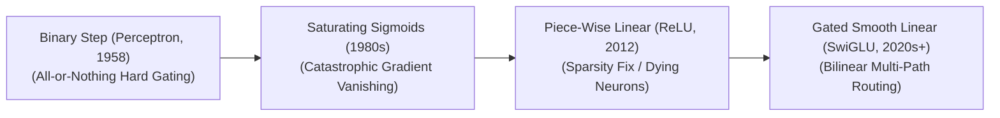

# Awesome-Activation-Function
## Activation Functions in AI: Evolution, Variants, Types, & Applications

Activation functions are fundamental mathematical operators embedded within the nodes of neural networks. They ingest the weighted sum of inputs and biases from the preceding layer and map it to an output activation vector. Crucially, activation functions introduce **non-linear transformation capabilities** into the network graph. Without non-linearity, a neural network—regardless of how many billions of layers it possesses—would collapse into a single, massive linear regression equation ($\hat{y} = Wx + b$), rendering it completely incapable of learning complex, high-dimensional data spaces such as images, natural language, or molecular arrays.

---

## 1. The Chronological Evolution

The technical progression of activation nodes has transitioned from rigid, binary step gates to piece-wise linear maps, smooth stochastic approximations, and high-capacity dual-tower gated linear transformations.

| Era / Phase | Year | First Paper Link | Details |
| :--- | :--- | :--- | :--- |
| **The Binary Threshold Era (The Perceptron Dawn)** | 1958 | [The Perceptron](https://doi.org/10.1037/h0042519) | **Concept:** Popularized by Frank Rosenblatt's early Perceptron. Used a hard **Binary Step function** that output exactly `0` if inputs were negative, and `1` if inputs crossed a strict positive activation threshold. **Limitation:** Non-differentiable; the zero-gradient property made it mathematically impossible to train multi-layer networks using backpropagation algorithms. |
| **The Saturating Smooth Era (Sigmoid & Tanh)** | 1986 | [Learning representations by back-propagating errors](https://www.nature.com/articles/323533a0) | **Concept:** Introduced continuous, differentiable curves. The **Sigmoid** function maps inputs to a clean $[0, 1]$ probability range, while **Hyperbolic Tangent (Tanh)** maps coordinates to $[-1, 1]$. **Limitation:** Suffered from the **Vanishing Gradient Problem**. When inputs become highly positive or negative, the slope of the curve approaches absolute zero, stalling weight updates across deep network layers during backpropagation. |
| **The Piece-Wise Linear & Sparsity Era (ReLU)** | 2012 | [ImageNet Classification with Deep CNNs](https://proceedings.neurips.cc/paper/2012/file/c3912af3adcd708d441235d52922185a-Paper.pdf) | **Concept:** The core deep learning revolution seen in AlexNet. **Rectified Linear Units ($\max(0, x)$)** kept positive inputs perfectly linear ($\text{slope} = 1$) while rigidly truncating negative inputs to zero, unlocking high mathematical sparsity. **Limitation:** Triggered the **Dying ReLU problem**, where neurons receiving consistently negative inputs update to permanent zero-gradient states, permanently deactivating major parameter blocks. |
| **The Gated Bilinear & Smooth Transformer Era** | 2020 | [GLU Variants Improve Transformer](https://arxiv.org/abs/2002.05202) | **Concept:** The current modern state-of-the-art paradigm across frontier Large Language Models (e.g., Llama 3, DeepSeek-V3). Combines smooth, non-monotonic curves (**Swish/SiLU**, **GELU**) with a **Gated Linear Unit (GLU)** framework. It splits a feature path into parallel linear channels, scales one channel through the smooth non-linear activation curve, and routes information via element-wise multiplication. |

---

## 2. Core Functional & Structural Variants

Activation functions are strictly categorized based on their mathematical continuity, symmetry, and feature-routing topologies.

| Variant | Year | First Paper Link | Details |
| :--- | :--- | :--- | :--- |
| **Saturating Non-Linear Activations** | 1986 | [Learning representations by back-propagating errors](https://www.nature.com/articles/323533a0) | **Mechanism:** Compresses infinite real-number input ranges into highly bounded, tight output coordinates, saturating heavily at extreme ends. **Examples:** Sigmoid, Tanh, and Hard-Sigmoid. |
| **Non-Saturating / Rectified Linear Extensions** | 2013 | [Rectifier Nonlinearities Improve Neural Network Acoustic Models](https://ai.stanford.edu/~amaas/papers/relu_hybrid_icml2013.pdf) | **Mechanism:** Maintains an unbounded linear mapping vector for positive parameters, implementing small leakage coefficients or statistical curves over negative values to prevent neuron death. **Examples:** Leaky ReLU, Parametric ReLU (PReLU), ELU (Exponential Linear Unit), and SELU. |
| **Stochastic & Smooth Approximations** | 2016 | [Gaussian Error Linear Units (GELUs)](https://arxiv.org/abs/1606.08415) | **Mechanism:** Scales inputs smoothly based on cumulative statistical distributions or probability gating functions, allowing minor negative activations to propagate stably. **Examples:** **GELU** (Gaussian Error Linear Unit, used in BERT/GPT) and **Swish / SiLU** ($x \cdot \sigma(x)$). |
| **Bilinear Gated Linear Units (GLU Class)** | 2016 | [Language Modeling with Gated Convolutional Networks](https://arxiv.org/abs/1612.08083) | **Mechanism:** Employs a dual-tower matrix calculation. One linear tensor projection actively acts as a non-linear gate to filter the parameter updates of its parallel twin layer block. **Examples:** **SwiGLU** (Swish-Gated) and **GEGLU** (GELU-Gated). |

---

## 3. Terminal Output Normalization Layer Types

While hidden layer activations drive abstract feature representation learning, terminal activation layers normalize model outputs into actionable classification probabilities.

| Layer Type | Year | First Paper Link | Details |
| :--- | :--- | :--- | :--- |
| **Softmax Normalization** | 1989 | [Training Stochastic Model Recognition Algorithms as Networks](https://papers.nips.cc/paper_files/paper/1989/hash/57aeee35c98205091e18d1100b9543e0-Abstract.html) | **Mechanism:** Computes the exponential of each input logit divided by the sum of exponentials across the entire vector. It converts raw distance coordinates into an exclusive probability map aggregation to exactly 1.0. **Application:** The standard output layer for multi-class classification and Transformer Self-Attention matrices. |
| **Sparsemax** | 2016 | [From Softmax to Sparsemax](https://proceedings.mlr.press/v48/martins16.html) | **Mechanism:** Replaces the exponential activation of Softmax with a mathematical projection onto a probability simplex. **Pros:** Automatically forces low-scoring elements to an absolute probability value of exactly zero, introducing true structural sparsity into model selections. |
| **Gumbel-Softmax** | 2016 | [Categorical Reparameterization with Gumbel-Softmax](https://arxiv.org/abs/1611.01144) | **Mechanism:** Injects continuous, independent Gumbel noise tensors into logit fields before temperature-controlled probability scaling occurs. **Pros:** Acts as a continuous, differentiable approximation of discrete categorical choices, allowing gradients to flow back through non-differentiable graph routing operations during training. |

---

## 4. Production Engineering Challenges & Hardware Solutions

Deploying non-linear activations inside massive foundation scales introduces critical system-level compute, memory, and compiler constraints.

| Challenge | Year | First Paper Link | Details |
| :--- | :--- | :--- | :--- |
| **The Activation VRAM Memory Explosion** | 2016 | [Training Deep Nets with Sublinear Memory Cost](https://arxiv.org/abs/1604.06174) | **The Problem:** Gated structures like SwiGLU require the hardware to split and cache massive, parallel intermediate tensor chunks before computing the final Hadamard multiplication, causing layer activation memory to swell during backward loops and triggering Out-of-Memory crashes. **Mitigation:** Implementing **Selective Activation Checkpointing**, which immediately discards non-linear intermediate layers after forward execution and rematerializes them on-the-fly during the backward pass. |
| **The GPU Memory-Bandwidth Boundary** | 2019 | [Triton: An Intermediate Language and Compiler](https://doi.org/10.1145/3315508.3329973) | **The Problem:** Executing separate, sequential PyTorch operators for matrix up-projection, exponential scaling, and tensor multiplication forces the hardware to write data out to slow High Bandwidth Memory (HBM) repeatedly, saturating the memory bus. **Mitigation:** Deploying hardware-fused kernels (such as **Liger Kernel** or custom Triton scripts). These compile the linear math, curve scaling, and tensor multiplication into a single GPU SRAM register execution block, maximizing token throughput. |

---

## 5. Frontier Real-World AI Applications

| Application | Year | First Paper Link | Details |
| :--- | :--- | :--- | :--- |
| **Autoregressive LLM Base Pre-Training Blocks** | 2020 | [GLU Variants Improve Transformer](https://arxiv.org/abs/2002.05202) | **Application:** Serves as the default non-linear computation engine inside state-of-the-art LLMs (e.g., Llama, Mistral, Gemma). Gated activations like **SwiGLU** prevent gradient saturation, allowing models to train stably over tens of trillions of tokens. |
| **Vision-Language Model Visual Grounding Pipelines** | 2023 | [Visual Instruction Tuning](https://arxiv.org/abs/2304.08485) | **Application:** Deployed within multi-modal transformers. Smooth activations like **GELU** process interleaved visual patch coordinates and text embeddings concurrently, maintaining sharp gradient trajectories during cross-attention alignment steps. |
| **Generative Diffusion & Flow Matching Latent Engines** | 2022 | [Flow Matching for Generative Modeling](https://arxiv.org/abs/2210.02747) | **Application:** Powers high-fidelity pixel synthesis networks (such as FLUX.1 or Stable Diffusion 3.5). Non-monotonic activation scaling maps continuous Gaussian noise variables into linear ordinary differential equation (ODE) trajectories precisely, yielding crisp image details. |
