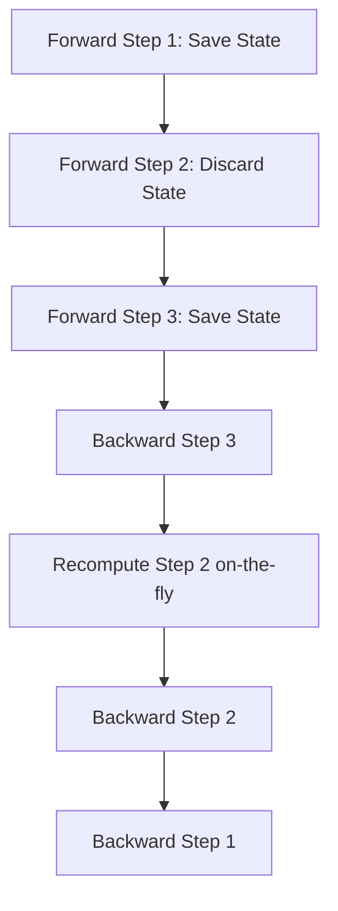

# Activation Checkpointing

## 📝 Overview
Activation checkpointing (also known as gradient checkpointing) is a technique used to train larger models by saving memory at the cost of extra compute. It stores only selected activations during the forward pass and recomputes others on-the-fly during backpropagation.

## 🧮 Mathematical Formulation
$$\text{Memory Complexity: } \mathcal{O}(\sqrt{N}) \text{ instead of } \mathcal{O}(N)$$

## 📊 Diagram

---

## 🔗 Navigation
- [Go back to README.md](../README.md)
