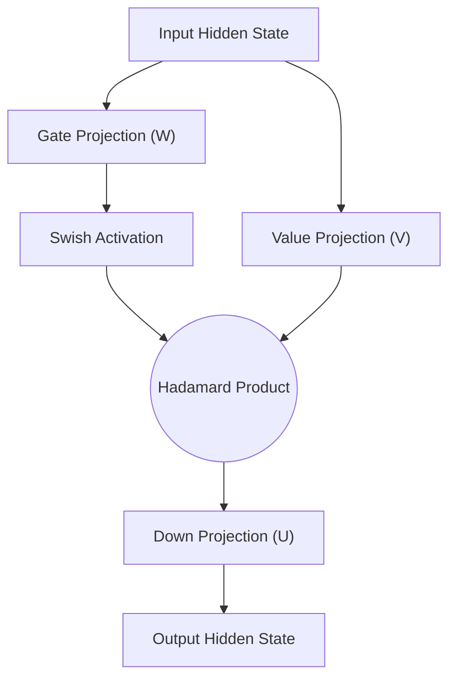

# Autoregressive LLM Base Pre-Training Activations

## 📝 Overview
Large Language Models (LLMs) like Llama, Gemma, and Mistral use SwiGLU in their Feed-Forward Network (FFN) blocks to stabilize pre-training across trillions of tokens and improve downstream reasoning performance.

## 🧮 Mathematical Formulation
$$\text{FFN}_{\text{SwiGLU}}(x) = (\text{Swish}(xW) \otimes xV)U$$

## 📊 Diagram

---

## 🔗 Navigation
- [Go back to README.md](../README.md)
