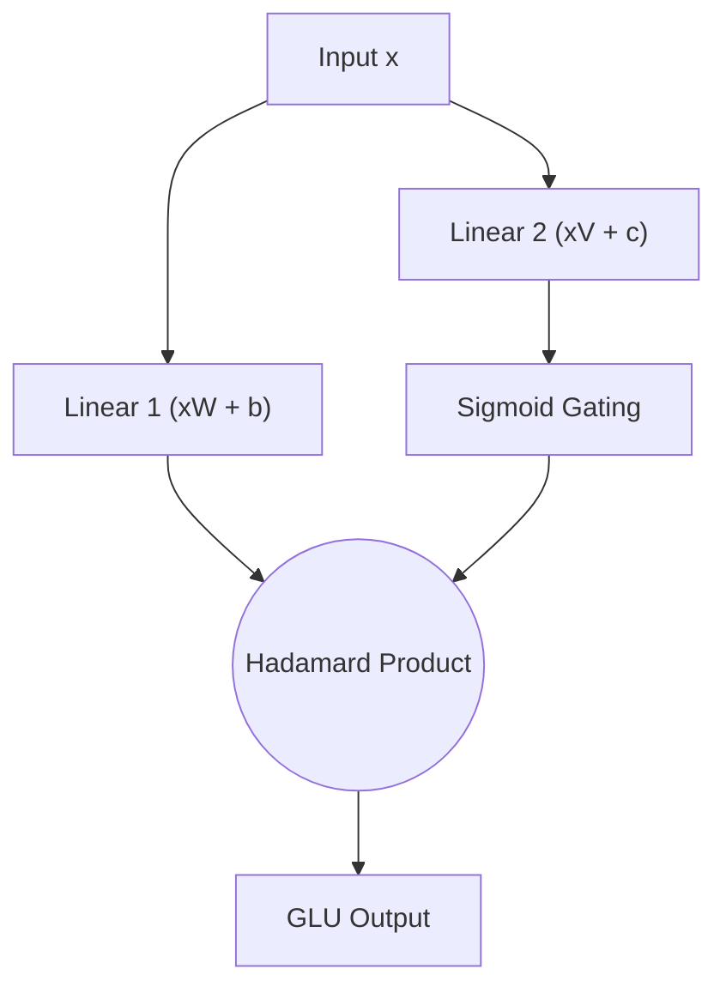

# Bilinear Gated Linear Units (GLU)

## 📝 Overview
A Gated Linear Unit (GLU) is a neural network layer defined as the component-wise product of two linear transformations of the input, one of which is gated using a sigmoid function. Variants include SwiGLU and GEGLU.

## 🧮 Mathematical Formulation
$$\text{GLU}(x, W, V, b, c) = (xW + b) \otimes \sigma(xV + c)$$

## 📊 Diagram

---

## 🔗 Navigation
- [Go back to README.md](../README.md)
