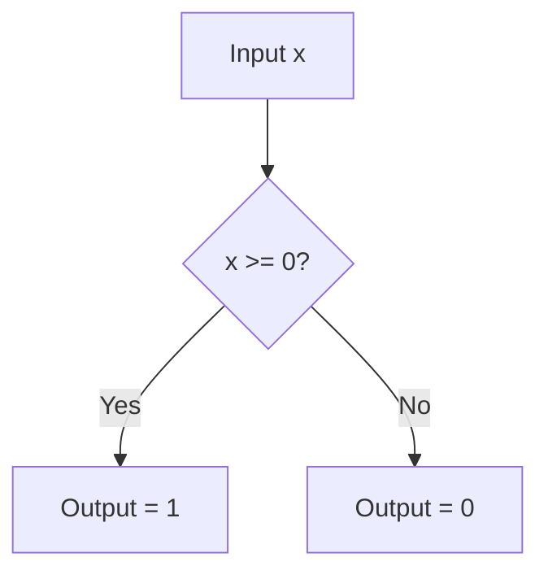

# Binary Step Activation Function

## 📝 Overview
The Binary Step function, also known as the threshold function, is the simplest activation function. It outputs a binary decision: 1 if the input is greater than or equal to a threshold, and 0 otherwise.

## 🧮 Mathematical Formulation
$$f(x) = \begin{cases} 0 & x < 0 \\ 1 & x \geq 0 \end{cases}$$

## 📊 Diagram

---

## 🔗 Navigation
- [Go back to README.md](../README.md)
