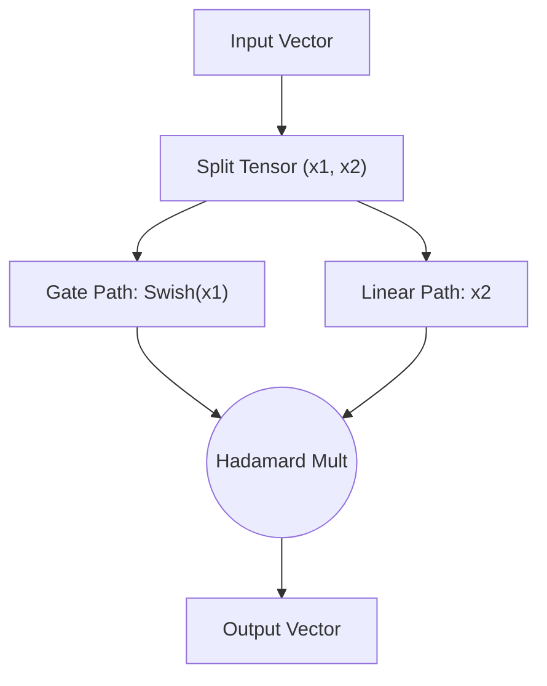

# Gated Smooth Transformer Activations

## 📝 Overview
Modern Transformer architectures (such as LLaMA, Mistral, etc.) rely on gated smooth non-linearities. These functions combine gating mechanisms (like Gated Linear Units, GLUs) with smooth approximations (such as SiLU/Swish and GELU) to improve representation capacity.

## 🧮 Mathematical Formulation
$$\text{Swish}(x) = x \cdot \sigma(\beta x), \quad \text{SwiGLU}(x, y) = \text{Swish}(x) \cdot y$$

## 📊 Diagram

---

## 🔗 Navigation
- [Go back to README.md](../README.md)
