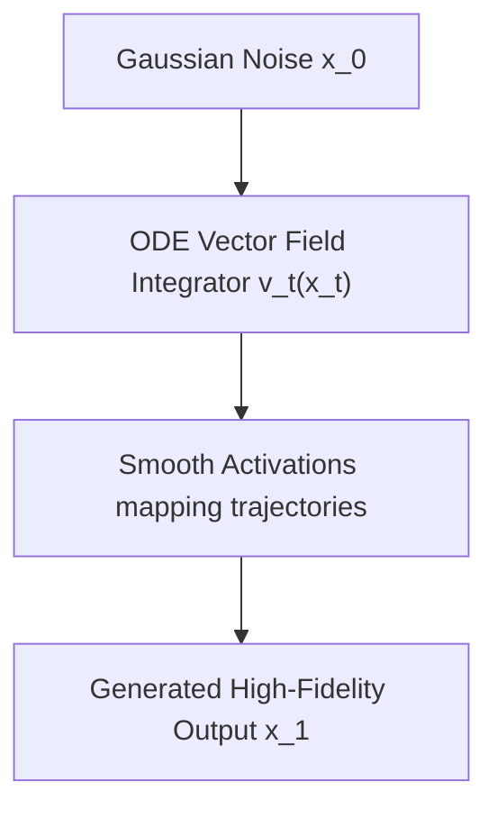

# Generative Diffusion & Flow Matching Latent Engines

## 📝 Overview
Latent diffusion models (like Stable Diffusion) and Flow Matching models (like FLUX.1) utilize non-monotonic activations (GELU, Swish) to project continuous noise variables into target data distributions via ordinary differential equation (ODE) vector fields.

## 🧮 Mathematical Formulation
$$\text{ODE Trajectory: } \frac{dx}{dt} = v_t(x_t)$$

## 📊 Diagram

---

## 🔗 Navigation
- [Go back to README.md](../README.md)
