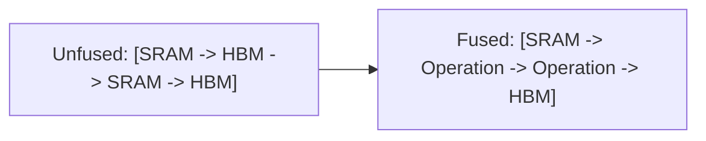

# GPU Memory-Bandwidth Boundary & Kernel Fusion

## 📝 Overview
Executing deep learning operations element-by-element triggers repeated memory reads and writes to High Bandwidth Memory (HBM). Kernel fusion combines multiple operations into a single kernel, caching intermediate results in fast GPU SRAM to bypass the HBM bottleneck.

## 🧮 Mathematical Formulation
$$\text{Roofline Model: } \text{Arithmetic Intensity} = \frac{\text{FLOPs}}{\text{Memory Access (Bytes)}}$$

## 📊 Diagram

---

## 🔗 Navigation
- [Go back to README.md](../README.md)
