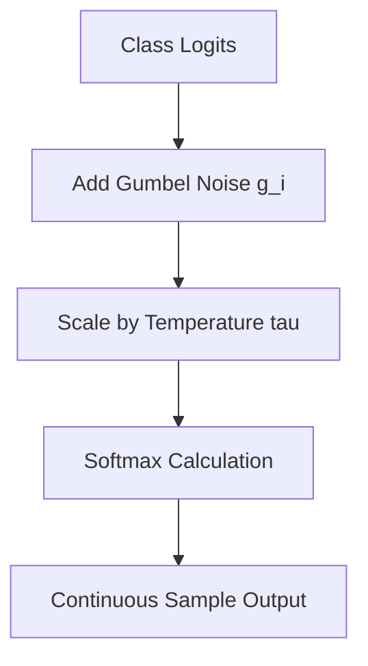

# Gumbel-Softmax Activation

## 📝 Overview
Gumbel-Softmax is a continuous distribution over the simplex that can be used to approximate categorical samples. It allows backpropagation through discrete categorical variables using the reparameterization trick.

## 🧮 Mathematical Formulation
$$y_i = \frac{\exp((\log(\pi_i) + g_i)/\tau)}{\sum_j \exp((\log(\pi_j) + g_j)/\tau)}$$

## 📊 Diagram

---

## 🔗 Navigation
- [Go back to README.md](../README.md)
