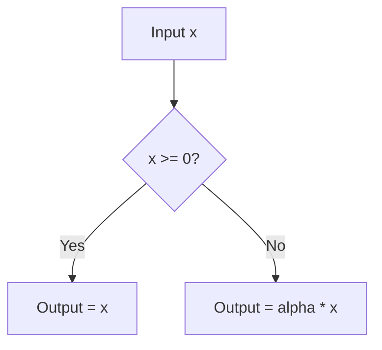

# Non-Saturating & Rectified Linear Extensions

## 📝 Overview
Extensions like Leaky ReLU, Parametric ReLU (PReLU), and Exponential Linear Units (ELU) prevent the 'dying ReLU' problem by ensuring that negative inputs still produce a non-zero gradient, allowing weights to continue updating.

## 🧮 Mathematical Formulation
$$\text{Leaky ReLU}(x) = \max(\alpha x, x) \quad (\alpha \approx 0.01)$$

## 📊 Diagram

---

## 🔗 Navigation
- [Go back to README.md](../README.md)
