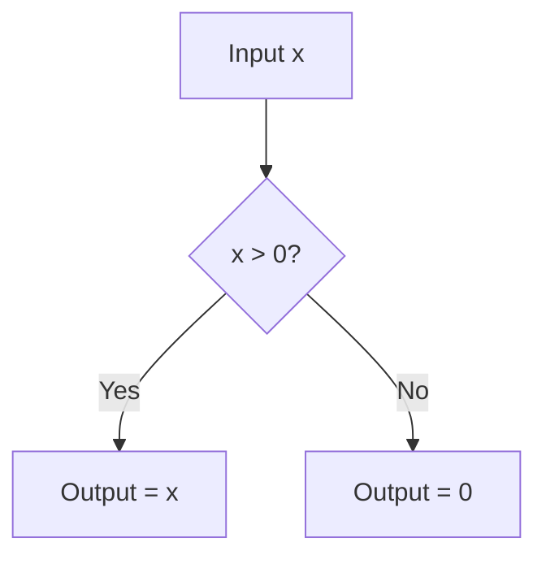

# Rectified Linear Unit (ReLU)

## 📝 Overview
ReLU is a piecewise linear function that outputs the input directly if it is positive, and zero otherwise. It is computationally efficient and helps mitigate the vanishing gradient problem, though it is susceptible to the 'dying ReLU' issue.

## 🧮 Mathematical Formulation
$$f(x) = \max(0, x)$$

## 📊 Diagram

---

## 🔗 Navigation
- [Go back to README.md](../README.md)
