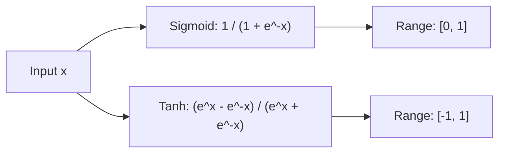

# Saturating Sigmoid and Tanh Activation Functions

## 📝 Overview
Sigmoid and Hyperbolic Tangent (Tanh) are smooth, continuously differentiable activation functions that map inputs into bounded ranges ($[0,1]$ and $[-1,1]$ respectively). They were the standard in early neural networks but suffer from vanishing gradients at extreme input values.

## 🧮 Mathematical Formulation
$$\sigma(x) = \frac{1}{1 + e^{-x}}, \quad \tanh(x) = \frac{e^x - e^{-x}}{e^x + e^{-x}}$$

## 📊 Diagram

---

## 🔗 Navigation
- [Go back to README.md](../README.md)
