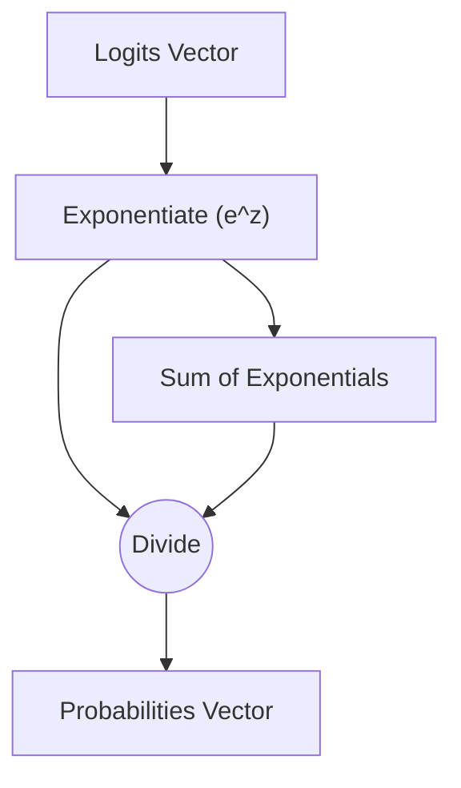

# Softmax Normalization

## 📝 Overview
Softmax normalizes an N-dimensional vector of real values into a vector of real values in range [0, 1] that sum to 1. It represents a categorical probability distribution over N outcomes.

## 🧮 Mathematical Formulation
$$\text{Softmax}(z_i) = \frac{e^{z_i}}{\sum_{j} e^{z_j}}$$

## 📊 Diagram

---

## 🔗 Navigation
- [Go back to README.md](../README.md)
