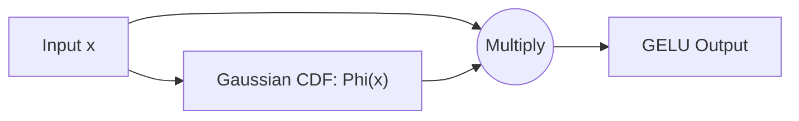

# Stochastic & Smooth Approximations

## 📝 Overview
Stochastic and smooth approximations like GELU (Gaussian Error Linear Unit) scale inputs probabilistically. GELU weights inputs by their value according to a Gaussian cumulative distribution function, making it smooth and non-monotonic.

## 🧮 Mathematical Formulation
$$\text{GELU}(x) = x \Phi(x) = x \cdot P(X \leq x), \text{ where } X \sim \mathcal{N}(0, 1)$$

## 📊 Diagram

---

## 🔗 Navigation
- [Go back to README.md](../README.md)
