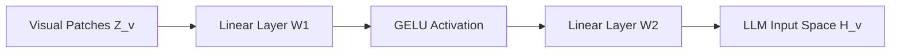

# Vision-Language Model Visual Grounding Activations

## 📝 Overview
Vision-Language Models (VLMs) like LLaVA bridge vision encoders and text LLMs using projection layers (often 2-layer MLPs) with GELU activation functions, preserving spatial coordinate gradients for visual grounding tasks.

## 🧮 Mathematical Formulation
$$H_v = W_2 \cdot \text{GELU}(W_1 \cdot Z_v)$$

## 📊 Diagram

---

## 🔗 Navigation
- [Go back to README.md](../README.md)
